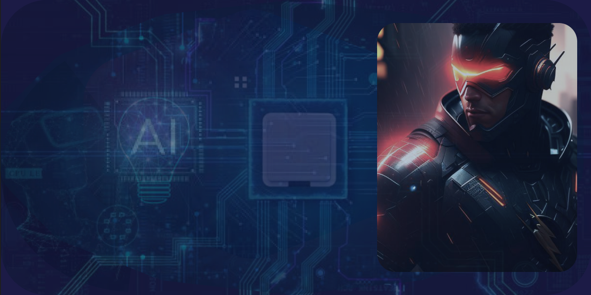

<h1 align="center">Hi, I'm Devaharsha!</h1>

  🔧 From GPIO to AI — I design intelligent systems that think, sense, and act.   
🧠 Passionate about bridging embedded systems with real-world intelligence.

---

<h2> Embedded Systems Projects</h2>

- <b>ESP32 Projects</b>  
  - [Displaying Alphabet on OLED](https://github.com/DevaharshaM/EspProjects/tree/OLEDdisplay)

- <b>Raspberry Pi Projects</b>  
  - [Linear & Rotational Distance](https://github.com/DevaharshaM/RaspberryPiProjects/tree/Accel/Gyro_Sensors)  
  - [Pattern Display on 8x8 LED Matrix](https://github.com/DevaharshaM/RaspberryPiProjects/tree/PatternDisplay)  
  - [RealSense Camera Streaming (Depth + RGB)](https://github.com/DevaharshaM/RaspberryPiProjects/tree/RealsenseDemo)

- <b>Arduino Projects</b>  
  - [Bluetooth Controlled System](https://github.com/DevaharshaM/ArduinoProjects/tree/BluetoothControlledSystem)  
  - [Game Controlled System](https://github.com/DevaharshaM/ArduinoProjects/tree/GameControlledSystem)  
  - [Lock System](https://github.com/DevaharshaM/ArduinoProjects/tree/LockSystem)  
  - [Remote Controlled Home Automation](https://github.com/DevaharshaM/ArduinoProjects/tree/RemoteControlledHomeAutomation)  
  - [Smoke Detection System](https://github.com/DevaharshaM/ArduinoProjects/tree/SmokeDetectionSystem)

- <b>Socket Programming in Python</b>  
  - [Client-Server Communication](https://github.com/DevaharshaM/PythonProjects/tree/Socket_Programming)

<h2> AI / Data Science Projects</h2>

- <b>Personalized University Selection Dashboard</b>  
  - [Dashboard](https://github.com/yashaharshika/Data-Visualization/tree/main)

- <b>Image Generation using GAN</b>  
  - [GAN](https://github.com/DevaharshaM/AI_Projects/tree/GAN)

- <b>Handwritten Digit Classification using DNN</b>  
  - [DNN](https://github.com/DevaharshaM/AI_Projects/tree/DNN)

- <b>Face Detection using Haar Cascades</b>  
  - [Face Detection](https://github.com/DevaharshaM/AI_Projects/tree/Face_Detection)

- <b>Monty Hall Problem Simulation</b>  
  - [Monty Hall](https://github.com/DevaharshaM/AI_Projects/tree/Monty_Hall)

- <b>Washing Machine Controller Simulation</b>  
  - [Washing Machine](https://github.com/DevaharshaM/AI_Projects/tree/Washing_Machine)

- <b>8 Queens Problem using Backtracking</b>  
  - [8 Queens](https://github.com/DevaharshaM/AI_Projects/tree/8_Queens)

- <b>Principal Component Analysis (PCA)</b>  
  - [PCA](https://github.com/DevaharshaM/AI_Projects/blob/PCA/pca.py)

<h2>🧩 Other Projects</h2>

- <b>QR Code Generator in Python</b>  
  - [QR Code Generator](https://github.com/DevaharshaM/PythonProjects/tree/qrcode)

---

## 📬 Connect with Me

If you'd like to collaborate, have a question, or want to connect:

- 📧 **Email**: [meesarapud@gmail.com](mailto:meesarapud@gmail.com)
- 💼 **LinkedIn**: [linkedin.com/in/devaharsham](https://www.linkedin.com/in/devaharsham)
- 💬 **WhatsApp**: [+44 7780 246719](https://wa.me/447780246719)
