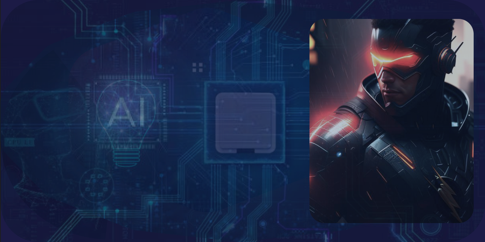

<h1><pre>Hi, I'm Devaharsha!</h1>

<h2> AI Projects</h2>

- <b>Placing 8 queens in a 8x8 chessboard such that no two queens attack each other</b>
  - [8-Queens](https://github.com/DevaharshaM/AI_Projects/tree/8_Queens)

- <b>Detecting human faces in an image</b>
  - [Face Detection](https://github.com/DevaharshaM/AI_Projects/tree/Face_Detection)
- <b>Implementing the scenario of the famous TV show "Monty Hall"</b>
  - [Monty Hall](https://github.com/DevaharshaM/AI_Projects/tree/Monty_Hall)
- <b>Recognizing object in an image</b>
  - [Object Recognition](https://github.com/DevaharshaM/AI_Projects/tree/Object_Recognition)
- <b>Finding the optimal route in the given map</b>
  - [Route Planning](https://github.com/DevaharshaM/AI_Projects/tree/Route_Planning)
- <b>Code for movie review sytem</b>
  - [Sentiment Analysis](https://github.com/DevaharshaM/AI_Projects/tree/Sentiment_Analysis)
- <b>Implementation of Washing Machine controller</b>
  - [Washing Machine](https://github.com/DevaharshaM/AI_Projects/tree/Washing_Machine)

<h2> Embedded Systems Projects</h2>

- <b>Socket Programming</b>
  - [Socket](https://github.com/DevaharshaM/PythonProjects/tree/Socket_Programming)

    
- <b>Arduino Projects</b>
  - [Bluetooth Controlled System](https://github.com/DevaharshaM/ArduinoProjects/tree/BluetoothControlledSystem)
  - [Game Controlled System](https://github.com/DevaharshaM/ArduinoProjects/tree/GameControlledSystem)
  - [Lock System](https://github.com/DevaharshaM/ArduinoProjects/tree/LockSystem)
  - [Home Automation](https://github.com/DevaharshaM/ArduinoProjects/tree/RemoteControlledHomeAutomation)
  - [Smoke Detection System](https://github.com/DevaharshaM/ArduinoProjects/tree/SmokeDetectionSystem)
    
<h2> Connect with me</h2>

[][gmail]
[][linkedin]
[][Whatsapp]

[linkedin]: https://www.linkedin.com/in/devaharsha-m-49779b118/
[gmail]: meesarapud@gmail.com
[Whatsapp]: +447780246719
